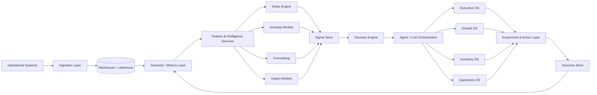

# ⚡ CARS24 Australia Intelligence OS

> An AI-native operating intelligence prototype for a multi-location automotive marketplace.

**CARS24 Australia Intelligence OS** is an independently built product concept exploring how a national automotive marketplace could connect growth, inventory, operations and capital decisions into a single intelligence layer.

Instead of another dashboard that tells operators what happened, the system is designed around a more useful question:

> **What needs leadership attention today — and what should we do about it?**

The prototype uses synthetic operational data and is not connected to confidential or internal CARS24 systems.

---

## Live Prototype

**Product:** https://cars24-australia-os.streamlit.app

The prototype includes multiple operating environments:

- Executive Intelligence
- Growth Intelligence
- Inventory Intelligence
- Operations Intelligence
- Builder / Experimentation Layer

---

# The Problem

At scale, automotive marketplaces generate enormous amounts of operational information across:

- vehicle acquisition
- inventory
- pricing
- enquiries
- test drives
- sales
- marketing
- reconditioning
- branch operations
- customer behaviour
- working capital

The problem is rarely the absence of data.

The problem is turning fragmented operational data into **decisions quickly enough to matter**.

A leadership team should be able to ask:

- Where is revenue leaking?
- Which inventory is consuming unnecessary capital?
- Which location or vehicle cohort is underperforming?
- Where is conversion breaking?
- What changed since yesterday?
- Which issue deserves attention first?
- What is the likely economic impact?
- What intervention should we test?

The Intelligence OS is an exploration of that operating layer.

---

# Product Philosophy

Most business intelligence systems follow:

`Data → Dashboard → Human interpretation → Meeting → Decision`

This prototype explores:

`Data → Signal → Diagnosis → Economic Impact → Recommendation → Experiment → Decision`

The objective is not to replace operators.

It is to dramatically reduce the distance between **something changing in the business** and **someone making the right decision about it**.

---

# Example

The synthetic dataset identifies a growth anomaly:

### Melbourne · SUV

Enquiry → test-drive conversion:

**31.0%**

Network benchmark:

**44.1%**

Median response time:

**42 minutes**

The system identifies the cohort, estimates the economic opportunity and recommends investigating:

- lead response time
- vehicle pricing
- inventory availability
- test-drive scheduling
- cohort-specific funnel behaviour

**Modeled monthly upside: $625K**

Rather than simply displaying conversion performance, the Intelligence OS converts the anomaly into a leadership decision.

---

# System Architecture

```mermaid
flowchart TD

    A[Operational Data Sources]

    A --> B1[CRM / Enquiries]
    A --> B2[Vehicle Inventory]
    A --> B3[Sales & Transactions]
    A --> B4[Pricing]
    A --> B5[Reconditioning]
    A --> B6[Marketing]
    A --> B7[Finance / Capital]

    B1 --> C[Canonical Operating Data Layer]
    B2 --> C
    B3 --> C
    B4 --> C
    B5 --> C
    B6 --> C
    B7 --> C

    C --> D1[Growth Intelligence]
    C --> D2[Inventory Intelligence]
    C --> D3[Operations Intelligence]
    C --> D4[Market Intelligence]

    D1 --> E[Signal Engine]
    D2 --> E
    D3 --> E
    D4 --> E

    E --> F[Decision Intelligence Layer]

    F --> G1[Anomaly Detection]
    F --> G2[Benchmarking]
    F --> G3[Root-Cause Analysis]
    F --> G4[Economic Impact Modeling]
    F --> G5[Recommendations]

    G1 --> H[Leadership Intelligence]
    G2 --> H
    G3 --> H
    G4 --> H
    G5 --> H

    H --> I1[Command Centre]
    H --> I2[Morning Brief]
    H --> I3[Investigate Cohort]
    H --> I4[Scenario Engine]
    H --> I5[Experiment Builder]

    I3 --> J[Decision / Intervention]
    I4 --> J
    I5 --> J

    J --> K[Outcome Measurement]

    K --> C
```



The feedback loop is important.

The system should eventually learn not only **what happened**, but which interventions actually improved outcomes.

---

# Intelligence Architecture

The product is separated into four primary intelligence domains.

## 1. Growth Intelligence

Answers:

> Where is growth leaking?

Analyzes performance across:

- locations
- vehicle segments
- funnel stages
- response times
- conversion
- pricing
- customer cohorts

Signals are ranked by estimated economic impact rather than simply percentage deviation.

---

## 2. Inventory Intelligence

Answers:

> Where is capital trapped?

Potential signals include:

- ageing inventory
- slow-moving cohorts
- acquisition quality
- pricing mismatches
- days-to-sale
- reconditioning delays
- capital concentration
- location-level inventory imbalance

The objective is to treat every vehicle not merely as inventory, but as a **capital allocation decision**.

---

## 3. Operations Intelligence

Answers:

> Where is execution breaking?

Potential operating signals include:

- location conversion variance
- lead-response delays
- reconditioning throughput
- test-drive capacity
- operational bottlenecks
- SLA failures
- branch performance divergence

---

## 4. Market Intelligence

Answers:

> What is changing outside the company?

Future inputs could include:

- used-car pricing
- vehicle demand
- competitor inventory
- geographic demand
- financing conditions
- EV adoption
- supply changes
- macroeconomic indicators

This creates context for internal operational signals.

---

# Decision Intelligence Layer

This is the core of the system.

A signal is not useful merely because something changed.

Every high-value signal should contain:

```text
WHAT HAPPENED
      ↓
WHERE DID IT HAPPEN
      ↓
WHY DOES IT MATTER
      ↓
WHAT IS THE ECONOMIC IMPACT
      ↓
WHAT MAY HAVE CAUSED IT
      ↓
WHAT SHOULD WE DO
      ↓
HOW DO WE TEST IT
      ↓
DID IT WORK
```

This converts analytics into an operating system for decisions.

---

# Executive Command Centre

The Executive environment compresses the operating system into a leadership view.

It surfaces:

- Revenue
- Sales
- Capital at Risk
- Open Decisions
- Modeled Opportunity
- Highest-value signals
- Recommended actions
- Confidence estimates

The goal is intentionally not to show every metric.

It is to show the **few things worth acting on**.

---

# Morning Brief

The Morning Brief explores a different interface for the same intelligence system.

Instead of leadership opening multiple dashboards each morning, the system generates a concise operating brief:

> What changed?

> Why does it matter?

> What needs a decision?

> What should we do today?

This could eventually be delivered through the application, email, Slack, Teams or an AI operating agent.

---

# Experimentation Layer

Recommendations should not automatically become decisions.

The system therefore introduces an experimentation layer.

For example:

**Signal**

Melbourne SUV enquiry → test-drive conversion is materially below benchmark.

**Hypothesis**

Slow lead response is contributing to the conversion gap.

**Experiment**

Route high-intent SUV enquiries into a priority response queue.

**Success metric**

Increase enquiry → test-drive conversion.

**Decision**

Scale, modify or stop the intervention based on measured results.

This creates a closed-loop operating system:

`Detect → Diagnose → Decide → Experiment → Measure → Learn`

---

# AI / Agentic Evolution

The current prototype is primarily deterministic and synthetic.

A production architecture could introduce specialised agents:

### Signal Agent
Continuously identifies meaningful deviations.

### Investigation Agent
Explores possible causes across datasets.

### Economics Agent
Estimates revenue or capital impact.

### Recommendation Agent
Generates possible interventions.

### Experiment Agent
Designs measurable tests.

### Executive Briefing Agent
Compresses the operating environment into leadership-level intelligence.

Agents should operate on governed data and structured tools rather than unrestricted autonomous execution.

---

# Production Architecture



---

# Technology

Current prototype:

- Python
- Streamlit
- Pandas
- synthetic operational datasets
- modular intelligence logic
- Git / GitHub
- Streamlit Community Cloud

A production implementation could evolve toward:

- Python / FastAPI
- PostgreSQL
- Snowflake / BigQuery / Databricks
- dbt
- event-driven ingestion
- feature pipelines
- ML anomaly detection
- forecasting models
- LLM orchestration
- vector / knowledge retrieval where appropriate
- React / Next.js executive applications
- observability and model evaluation infrastructure

---

# Repository Structure

```text
cars24-australia-builder/
│
├── app/
│   ├── intelligence_os.py
│   ├── command_center.py
│   └── ...
│
├── intelligence/
│   ├── growth/
│   ├── inventory/
│   ├── operations/
│   └── market/
│
├── data/
│   └── synthetic/
│
├── models/
│
├── tests/
│
├── docs/
│   └── architecture/
│
├── requirements.txt
└── README.md
```

The repository is structured around intelligence capabilities rather than UI pages so the product can evolve independently of Streamlit.

---

# What This Prototype Is

This is:

- a product architecture exploration
- an operating intelligence prototype
- a demonstration of decision-oriented analytics
- an exploration of agentic operating workflows
- a synthetic-data proof of concept

It is **not**:

- an official CARS24 product
- connected to CARS24 internal systems
- trained on confidential CARS24 information
- claiming that the synthetic metrics represent actual company performance

---

# Why I Built It

I wanted to explore a simple question:

> If I joined a company like CARS24 Australia as a founder-adjacent operator/builder, what could I build that would make leadership materially faster at understanding and operating the business?

Rather than answering that question with a presentation, I built the first version.

---

## Built by Vaibhav Venu

Operator × Product Builder × GTM × AI

I like working on problems where product, operations, economics, data and execution collide.

This repository is part of a broader portfolio exploring how AI-native operating systems can augment teams and leadership.
