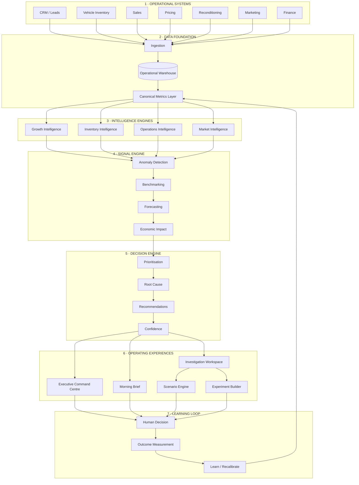

# CARS24 Australia Intelligence OS — Architecture

## System Model

---

## Core Principle

The architecture deliberately separates:

**Data → Intelligence → Signals → Decisions → Actions → Outcomes**

This allows individual components to evolve independently.

The Streamlit application is therefore an interface to the intelligence system rather than the intelligence system itself.

## Production Evolution

The prototype currently uses synthetic datasets and local intelligence logic.

A production implementation could progressively replace these components with:

- warehouse-native datasets
- streaming operational events
- governed semantic metrics
- statistical anomaly detection
- forecasting models
- causal / experiment measurement
- LLM-assisted investigation
- agentic workflows
- human approval gates
- outcome-based learning

The architectural objective is a closed-loop decision system rather than a traditional BI stack.
